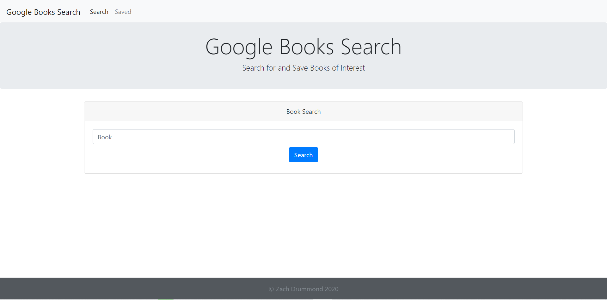
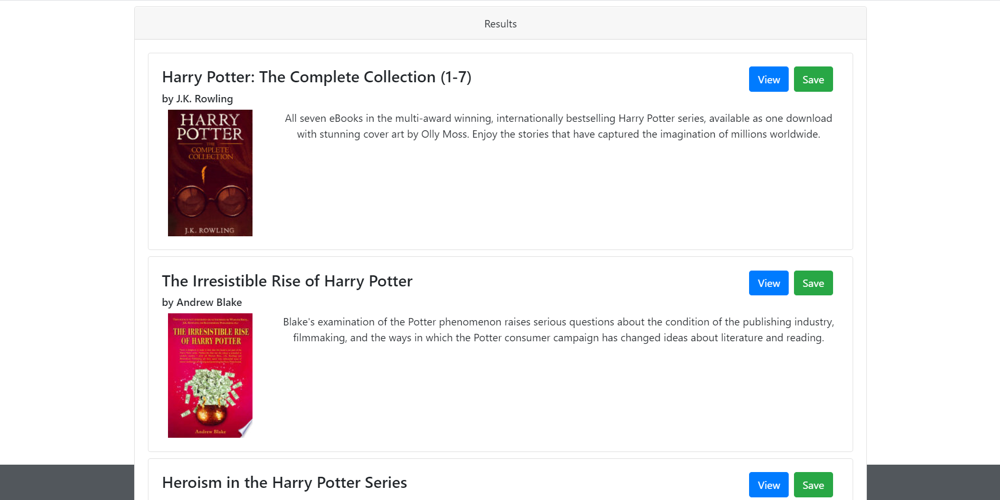
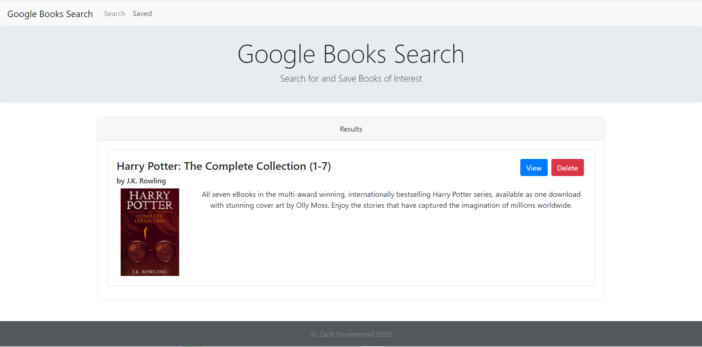

# google-books-search

## Table of Contents
* [Description](#Description)
* [Links](#Links)
* [Usage](#Usage)
* [Design Elements](#Design-Elements)
* [App Preview](#App-Preview)
* [Credits](#Credits)

## Description
This is an app that can find and save any book's basic information via Google Books API.

## Links
* Website: https://google-books-search-zd.herokuapp.com/search
* GitHub Repository: https://github.com/zachdrummond/google-books-search

## Design Elements
* JavaScript
* React.js
* Node.js
* Express.js
* Mongoose.js
* MongoDB
* Bootstrap
* CSS
* Node Package Manager - Axios
* Model View Controller Architecture

## App Preview
### *Home Page*

### *Search Bar*

### *Sort by Name*

## Credits
* https://reactjs.org/
* https://nodejs.org/en/
* http://expressjs.com/
* https://www.mongodb.com/
* https://mongoosejs.com/
* https://www.npmjs.com/
* https://www.npmjs.com/package/axios
* https://getbootstrap.com/
* https://www.heroku.com/